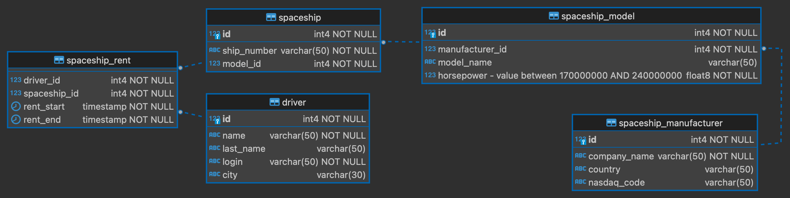

# Домашка 4. Миграции базы данных

Две тысячи n-ый год. Космический хаб сервиса Yandex.CosmoDrive для краткосрочной аренды межпланетных кораблей переходит 
на новую версию приложения космолеташеринга. 

Исходный код для формирования базы отсутствует - в вашем распоряжении имеется лишь описание стейта базы данных на каждом этапе разработки. Планируется в несколько этапов перейти к новому состоянию базы.

Вам необходимо создать миграции базы данных для того, чтобы перевести базу в указанные состояния. Код миграций нужно поместить в соответствующие файлы в директории `migrations/python`

## Задача
Ваша задача состоит в том, чтобы написать 3 миграции для базы данных. Миграции необходимо разместить в директории `migrations/python`. 
Миграции необходимо реализовать для инструмента Alembic. Конфигурацию Alembic-а необходимо также разместить в данной директории.
Параметры доступа к базе:

> host:     **postgres** // for local test use **localhost** <br>
> db:       **sdb_homework** <br>
> user:     **admin** <br>
> pswrd:    **admin** <br>
> port:     **5432** <br>

### Миграция 1
Дана пустая база данных. Первая миграция должна привести базу к следующей схеме:

* Допустимое значение horsepower находится между 170000000 и 240000000

### Миграция 2
Вторая миграция должна заполнить БД данными из csv-файлов из директории `migrations/init_data`

### Миграция 3
В рамках третьей миграции мы должны совершить ряд преобразований над таблицами, в которых уже присутствуют данные.

У таблицы `driver` мы должны объединить стобцы `name` и `last_name` в новый стобец `full_name` (макс. длина 255) 
(в котором укажем name и last_name через пробел). Важно, чтобы данные при переезде трансформировались правильно 
и не потерялись.

В таблице `spaceship_manufacturer` мы хотим заменить столбец `nasdaq_code` на столбец `moex_code`, перенеся в него
значения из столбца `nasdaq_code` с суффиксом `_ru`.

## Как сдать домашку
0. Форкнуть (fork) данный репозиторий с заданием в свой репозиторий;
1. Написать 3 миграции и конфиг для утилиты миграций. Положить их в директорию `migrations/python`
2. Запустить тесты локально и убедиться, что все работает.
3. Запушить в новую ветку в свой репозиторий. Убедиться, что тесты проходят в gitlab-е.
4. Создать MR и приложить ссылку на него в тикет с домашкой

## Как запустить тесты локально
Установите зависимости:
```bash
pip install poetry
poetry install
```

Пропишите в переменных окружения следующие переменные:
```bash
POSTGRES_DB: sdb_homework
POSTGRES_USER: admin
POSTGRES_PASSWORD: admin
SDB_TRACK: python
```

Запустите базу в докере - в корневой директории проекта выполните команду:
```bash
docker-compose up
```

Проверьте, что в конфиге для утилиты миграции указан хост базы - localhost с верными параметрами подключения. Запустите тесты:
```bash
poetry run pytest
```
